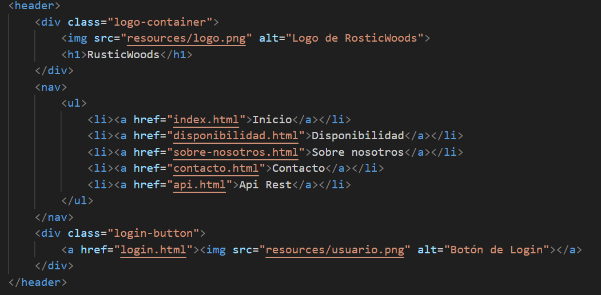
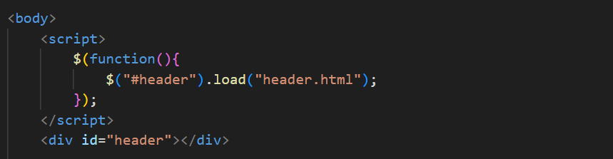
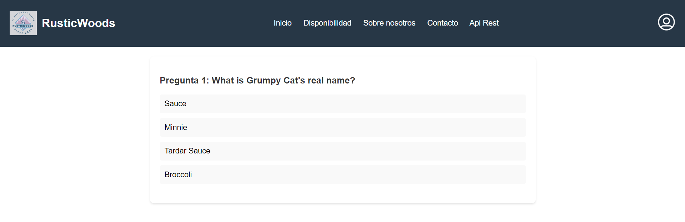
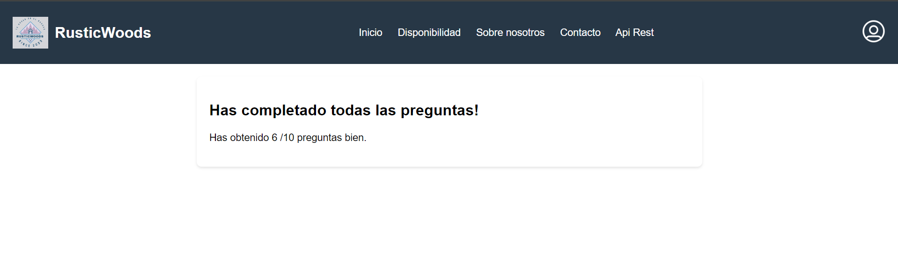

# Práctica 3:

**Autor:** Gonzalo de Alfonso Borrachero (201901076)

**Clase:** 3ºA GITT
## Javascript:
Con los nuevos conocimientos adquiridos sobre el lenguaje de programación Javascript, en mi página web tenía el código del *header* repetido en cada uno de mis ficheros `.html`. Ahora que ya hemos aprendido este lenguaje, he creado un nuevo fichero `header.html` en el que he introducido la lógica de la programación del *header* para que así solo tenga que llamar mediante una función a mi fichero `header.html` en cada uno de mis ficheros, evitando tener que repetir el código.

### *header.html*:

 

### Función para llamar al fichero *header.html*

De esta forma, además, es más fácil gestionar la página web y realizar cambios en el *header*, ya que solo lo tengo que cambiar desde un fichero concreto y no en cada uno de ellos.

## API:
Como se pedía para la práctica, he implementado un nuevo botón dentro de mi *header* en la página principal donde he añadido una sección para hacer la llamada a la API. La API que he utilizado es la siguiente: [https://opentdb.com/api_config.php](https://opentdb.com/api_config.php)

Consiste en un juego de Trivial, el cual tú tienes que ir respondiendo a una serie de preguntas con múltiples opciones de respuesta, y deberás seleccionar la correcta.

### Imágenes de la API en acción:
 

 

 

Y por último, el juego te dirá cuántas preguntas has respondido correctamente.

 
